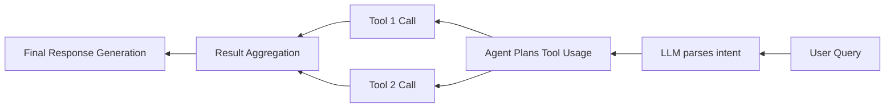

# Paper Reading

## APIGen: Automated Pipeline for Generating Verifiable and Diverse Function-Calling Datasets

---
transition: slide-left
---

## Tool Usage: LLm -> Agent

**Background & Current Status**

* LLMs can autonomously invoke tools (e.g., weather APIs, calculators, databases, REST APIs), enabling real-time code execution ([proceedings.neurips.cc][1]).
* Widely applicable across domains like social networking, finance, travel, etc.

---
transition: slide-left
---

## Tool Usage: LLm -> Agent

**Major Challenges**

* **Data Quality**: Training data is static, noisy, and lacks accurate execution results.
* **Generalization to Unseen APIs**: Poor adaptability to new APIs.
* **Complex Calling Chains**: Difficulties with parallel/serial calls and semantic dependencies.

New Problems: Lack of function calling

---
transition: slide-left
---

## Prior Work on Tool-Using Agents & Datasets

**Representative Work**

* Toolformer: Fine-tunes LLMs to invoke tools like QA, calculator, and search ([arxiv.org][2]).
* RestGPT, xLAM, Octopus-v4, Gorilla: Multi-stage tool-using agents ([proceedings.neurips.cc][1]).
* Existing datasets: AgentInstruct, APIBank, Toolalpaca, ToolBench, etc.

 
 
 

---

## Shortcomings in Existing Work

* **Lack of Validation**: Many datasets are auto-generated without execution or semantic checks — high noise.
* **Limited Scale**: Too few API types or calling scenarios.
* **Lack of Call Chain Complexity**: No support for realistic multi-function chains (e.g., parallel/serial usage).

---

## APIGen: A New Approach to Address These Gaps

**Core Contributions**

* Proposes APIGen — an automated pipeline with three-stage verification: format, execution, and semantic validation ([proceedings.neurips.cc][3]).
* Collects 3,673 executable APIs across 21 categories, generating 60,000 high-quality samples.
